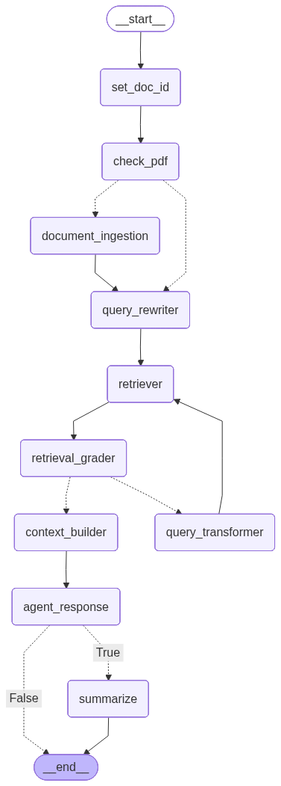
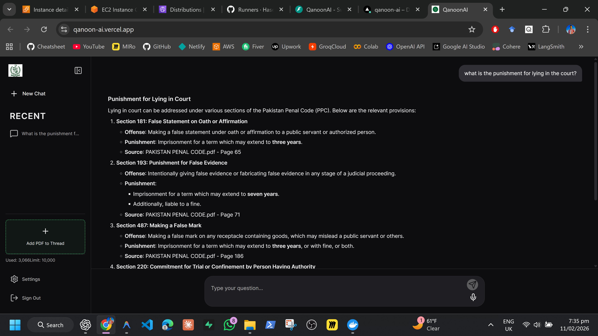
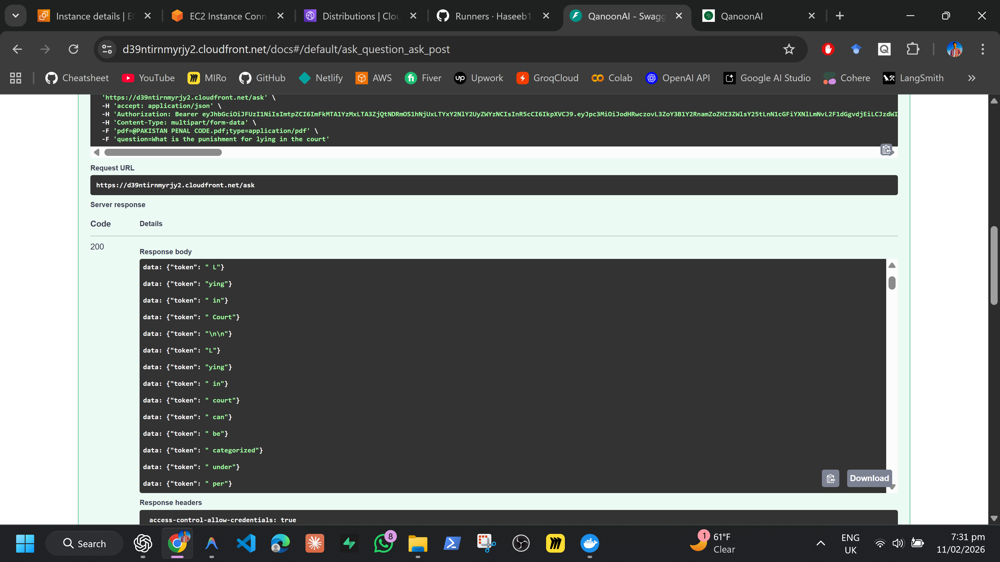

# QanoonAI - Agentic Legal Assistant

<!--  -->

**QanoonAI** is an intelligent, agentic RAG (Retrieval-Augmented Generation) system designed for legal queries. It leverages advanced AI to process legal documents, understand context, and provide accurate, citation-backed answers.

# App

# Backend


## 🚀 Features

- **Agentic RAG**: Context-aware retrieval and generation using LangGraph.
- **Multi-PDF Support**: Upload and query multiple legal documents within a single conversation thread.
- **Intelligent Summarization**: Automatically summarizes long conversation threads to maintain context.
- **Audio Integration**: Voice input and text-to-speech output for accessible interaction.
- **Rate Limiting**: Built-in token usage tracking to manage costs and prevent abuse.
- **Secure Authentication**: User authentication via Supabase Auth.

## 🛠️ Tech Stack

### Frontend
- **Framework**: React v19
- **Build Tool**: Vite
- **Styling**: Tailwind CSS v4

### Backend
- **API**: FastAPI (Python)
- **AI Framework**: LangChain & LangGraph
- **Package Manager**: `uv`

### Database & Infra
- **Database**: Supabase (PostgreSQL + pgvector)
- **Deployment**: AWS EC2 (Backend) & Vercel (Frontend)

---

## 🏁 Getting Started

Follow these steps to set up the project locally.

### Prerequisites
- **Python 3.10+** (Recommend using `uv` for management)
- **Node.js 18+** & `npm`

### 1. Backend Setup

```bash
# Install uv if you haven't already
pip install uv

# Initialize and install dependencies
uv init
uv add -r requirements.txt

# Run the FastAPI server
uv run uvicorn backend.app:app --reload
```

The backend API will be available at `http://localhost:8000`.

### 2. Frontend Setup

Open a new terminal and navigate to the `frontend` directory:

```bash
cd frontend

# Install dependencies
npm install

# Start the development server
npm run dev
```

The frontend will be available at `http://localhost:5173`.

---

## 📂 Project Structure

- `backend/`: FastAPI application, and API routes.
- `src/`: LangGraph orchestration.
- `frontend/`: React application source code.
- `docs/`: Additional documentation and diagrams.
- `.github/workflows/`: CI/CD pipelines for AWS deployment.

