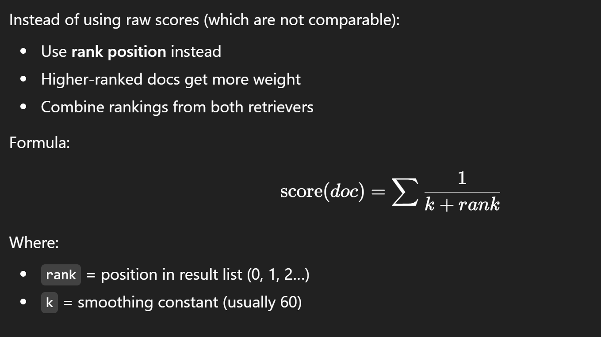

# ✅ 1. Enable HNSW Indexing (BIGGEST speed boost)

Your pgvector retrieval probably uses a **flat scan** unless you manually created an index.

Run this in Supabase SQL Editor:

```sql
CREATE INDEX IF NOT EXISTS idx_hnsw_embeddings
ON documents
USING hnsw (embedding vector_cosine_ops);
```

This alone speeds retrieval by **10x–50x**.

---

# ✅ 2. Reduce embedding size

Use **text-embedding-3-small**, not large.

Smaller vector = faster ANN search.

---

# ✅ 3. Tenant-level filtering BEFORE search

Your query must do:

```sql
SELECT id, content
FROM documents
WHERE tenant_id = :tenant_id
ORDER BY embedding <=> :query_embedding
LIMIT 10;

```


---


# ✅ 5. Reduce top-K search values

Set:

* BM25 → top 10
* Dense → top 10
* RRF final → top 3

Removing extra documents reduces:

* merge time
* LLM prompt length
* overall token latency

---

# ✅ 6. Use **asyncio.gather** for parallel retrieval (you’re already doing this)

```python
bm25_task = bm25_search(...)
dense_task = dense_search(...)

bm25_docs, dense_docs = await asyncio.gather(
    bm25_task,
    dense_task
)
```

Parallel I/O gives **2x speedup** instantly.

---

# ✅ 7. Persistent caching (Redis or in-memory)

Cache queries such as:

```
(tenant_id + query_normalized)
```

TTL: **300–900 sec**.

This gives **instant responses** for repeated questions.

---

# ✅ 8. Reduce LLM context size

Before sending docs to LLM:

* keep top 3 docs
* compress long docs
* remove stopwords
* trim whitespace
* EmbeddingsRedundantFilter + LongContextReorder

Smaller prompt = **faster first token**.

---

# 🚀 PRODUCTION-PROVEN COMBINATION (do THIS)

To get *maximum* speed:

### **Mandatory for SaaS-level speed**

* HNSW index
* tenant_id filter early
* async retrieval + parallel I/O
* reduce top-K
* pre-embedding docs

### **Optional but powerful**

* caching
* smaller embeddings
* compress docs before LLM

---


# hybrid retrival
### Reciprocal Rank Fusion to merge BM25 and dense retrieval results

```python
def rrf_merge(bm25_docs, dense_docs, k=60, top_n=5):
    scores = {}

    for rank, doc in enumerate(bm25_docs or []):
        doc_id = doc.get("id")
        if not doc_id:
            continue
        scores[doc_id] = scores.get(doc_id, 0.0) + 1 / (k + rank)

    for rank, doc in enumerate(dense_docs or []):
        doc_id = doc.get("id")
        if not doc_id:
            continue
        scores[doc_id] = scores.get(doc_id, 0.0) + 1 / (k + rank)

    if not scores:
        return []

    return sorted(scores, key=scores.get, reverse=True)[:top_n]


import asyncio

async def hybrid_retrieve_node(state):
    query = state["query"]
    tenant_id = state["tenant_id"]

    bm25_task = bm25_search(query, tenant_id)
    dense_task = dense_search(query, tenant_id)

    bm25_docs, dense_docs = await asyncio.gather(
        bm25_task, dense_task, return_exceptions=False
    )

    doc_ids = rrf_merge(bm25_docs, dense_docs)

    docs = await fetch_documents_in_order(doc_ids)
    return {"documents": docs}


```