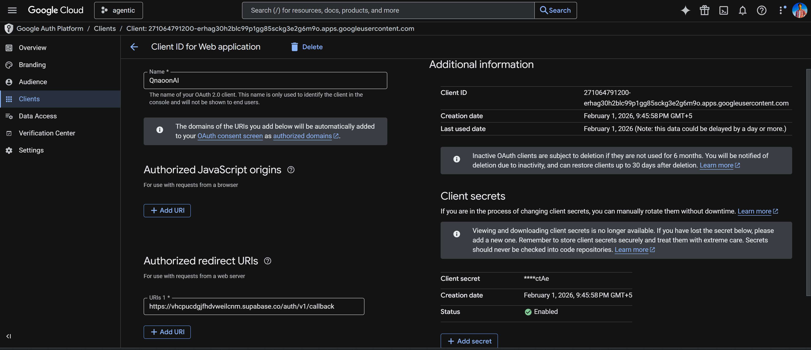
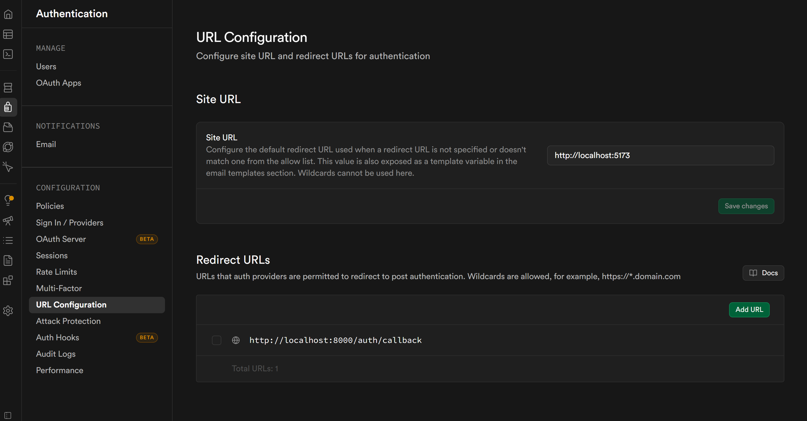
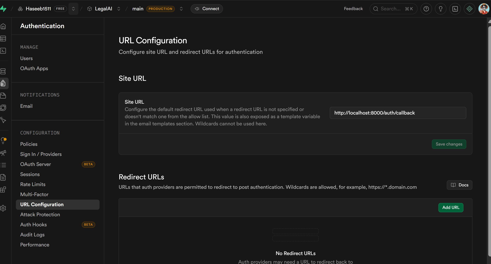

## 1️⃣What Google + Supabase Auth does for you:

Google OAuth is an external login provider.
When you click “Login with Google”, the user is redirected to Google.
Google asks them for email/password on their site, not on your app.
After they log in on Google, Supabase gets a token and your app now knows who the user is.
✅ This means you don’t need a login form for email/password if you only use Google login.


## **1️⃣ Install Required Packages**

You’ll need a few packages for Supabase auth integration:

```bash
pip install supabase pyjwt python-dotenv fastapi[all] httpx
```

* `supabase` → Supabase Python client
* `pyjwt` → To decode JWT from Supabase
* `httpx` → For async HTTP requests (needed by FastAPI for auth)
* `python-dotenv` → For loading `.env`

---

## **2️⃣ Configure Environment Variables**

Create or update your `.env` (make sure Docker passes it with `--env-file .env`):

```env
SUPABASE_URL=https://xyzcompany.supabase.co
SUPABASE_KEY=your-service-role-key-or-anon-key
GOOGLE_CLIENT_ID=your-google-client-id
GOOGLE_CLIENT_SECRET=your-google-client-secret
```

---

## **3️⃣ Initialize Supabase Client**

You already have `src/db_connection/connection.py`. Add auth support:

```python
from supabase import create_client
import os

SUPABASE_URL = os.getenv("SUPABASE_URL")
SUPABASE_KEY = os.getenv("SUPABASE_KEY")

supabase_client = create_client(SUPABASE_URL, SUPABASE_KEY)
```

✅ This will allow you to access both database and auth API.

---


## **5️⃣ Add Authentication Middleware / Dependency**

Create a file `backend/dependencies/auth.py`:

```python
from fastapi import Request, HTTPException
from src.db_connection.connection import supabase_client
import jwt

async def get_current_user(request: Request):
    auth_header = request.headers.get("Authorization")
    if not auth_header:
        raise HTTPException(status_code=401, detail="Missing auth")

    token = auth_header.replace("Bearer ", "")

    user = supabase_client.auth.get_user(token)

    if not user or not user.user:
        raise HTTPException(status_code=401, detail="Invalid token")

    return user.user
```

---

## **6️⃣ Protect Routes with Dependency**

In your `chat.py` or `threads.py`, you can now require authentication:
using user_id

---


---


---

## **2️⃣ JWT (JSON Web Token) — Authentication**

* **What it is:** A **token format** used to **prove identity**. Contains claims like `sub` (user ID), `email`, etc.
* **In your case:**

  * Supabase issues a **JWT access token** after the Google OAuth flow.
  * Your FastAPI backend decodes the JWT to verify who the user is (`get_current_user` dependency).
  * Routes use this decoded JWT to **authorize access** (e.g., only show threads for `user_id` from JWT).

✅ This part is **JWT-based authentication / authorization**.

---

## **3️⃣ How they work together in your app**

1. **OAuth 2.0** → Used **once** to let the user log in with Google.
2. **JWT** → Used **for every API request** to verify the user’s identity.

So technically:

* **OAuth 2.0** handles the login process with Google.
* **JWT** handles authentication inside your backend once the user is logged in.

---


---

## **1️⃣ GOOGLE_CLIENT_ID & GOOGLE_CLIENT_SECRET**

These come from **Google Cloud Console** because Google is your OAuth provider.

### Steps to get them:

1. Go to [Google Cloud Console → Credentials](https://console.cloud.google.com/apis/credentials)
2. Create a **new project** (or use an existing one).
3. **Enable OAuth consent screen** for your project:

   * Go to `APIs & Services → OAuth consent screen`.
   * Choose `External` if your app will be used by anyone with a Google account.
   * Fill in the required fields (app name, email, etc.).
4. Go to `Credentials → Create Credentials → OAuth client ID`.

   * Application type: **Web application**.
   * Authorized redirect URIs:

     ```
     http://localhost:8000/auth/callback
     ```

     (or your production URL when deployed)
5. After creating, Google will give you:

   * **Client ID** → use for `GOOGLE_CLIENT_ID`
   * **Client Secret** → use for `GOOGLE_CLIENT_SECRET`

✅ That’s it. These two are what Supabase needs to allow Google login.

---


## ✅ Correct Place to Enable Google (New Supabase UI)

### 🔹 Step-by-step (Exact clicks)

1. Open **Supabase Dashboard**
2. Select your project
3. Left sidebar → **Authentication**
4. Click **Providers** (NOT “Sign-in methods”)
5. Scroll down → **OAuth Providers**
6. You will see:

   * Google
   * GitHub
   * Discord
   * etc.

👉 **Google is there**, just lower on the page.

---


---

## ✅ What to Do Once You Find Google

### Enable Google

* Toggle **Enable**
* Paste:

  * **Client ID**
  * **Client Secret**
* Save

---

# Copy the call back url and paste it in google cloud console



## ✅ VERY IMPORTANT: Redirect URLs (People Miss This)
Still inside **Authentication**:
### Go to → **URL Configuration**
Set:

**Site URL**

```
http://localhost:5173
```

**Additional Redirect URLs**

```
http://localhost:8000/auth/callback
```


Save.

---

## ✅ How to Verify It Worked (Before Coding)

Paste this in browser:

```
https://YOUR_PROJECT_ID.supabase.co/auth/v1/authorize?provider=google
```

If you see:

* Google account picker → ✅ working
* Error page → ❌ misconfigured

---

# we can view out authenticated user here
go to Authentication --> users
